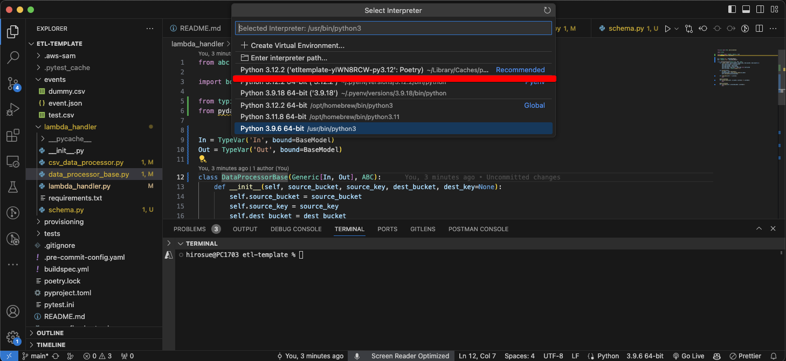

# etl-template

ETLTemplate is a comprehensive ETL (Extract, Transform, Load) solution, designed to facilitate seamless data processing workflows.

## Overview

This project leverages a sophisticated stack including:

- **Infrastructure Management** - [AWS CloudFormation](https://aws.amazon.com/cloudformation/): For reliable and systematic infrastructure provisioning.
- **Continuous Integration & Delivery** - [AWS CodePipeline](https://aws.amazon.com/codepipeline/): Ensures continuous integration and delivery workflows.
- **Serverless Application Model** - [AWS SAM (Serverless Application Model)](https://aws.amazon.com/serverless/sam/): Streamlines building, testing, and deploying serverless applications.
- **Dependency Management** - [Poetry](https://python-poetry.org/): A modern tool for Python dependency management and packaging.
- **Data Processing** - [Pandas](https://pandas.pydata.org/): Powerful data analysis and manipulation tool.
- **Data Modeling** - [Pydantic](https://pydantic-docs.helpmanual.io/): For data validation and settings management using Python type hinting.
- **AWS SDK** - [Boto3](https://aws.amazon.com/jp/sdk-for-python/): AWS SDK for Python, facilitating access to various AWS services.
- **Testing** - [pytest](https://docs.pytest.org/en/latest/): A mature full-featured Python testing tool.
- **Mock AWS Services** - [moto](https://github.com/spulec/moto): A library for mocking AWS services for testing purposes.
- **Code Formatting & Linting** - [pre-commit](https://pre-commit.com/), [Black](https://black.readthedocs.io/en/stable/), [isort](https://pycqa.github.io/isort/): Tools for maintaining code quality and style consistency.

ETLTemplate aims to streamline data workflows, from extraction and transformation to loading, ensuring efficiency and scalability in data processing tasks.

## Requirements

* Python 3.x
* Poetry

### Poetry Installation

https://python-poetry.org/docs/#installation

## Project setup

```bash
poetry install
```

### Check the project

```bash
poetry run pytest
```

## Git Hooks setup with code format(black) and import sort(isort)

```bash
poetry run pre-commit install
```

## VSCode setup

### Install the Python extension

### Virtual environment setup

* Click on the Python interpreter part displayed in the status bar at the bottom left.


* Select the virtual environment created by poetry.



## Copy common processing

```bash
cp lib/csv_data_processor.py lib/data_processor_base.py lambda_handler
```

* Customize common processing as needed.

## Deploy the sample application

The Serverless Application Model Command Line Interface (SAM CLI) is an extension of the AWS CLI that adds functionality for building and testing Lambda applications. It uses Docker to run your functions in an Amazon Linux environment that matches Lambda. It can also emulate your application's build environment and API.

To use the SAM CLI, you need the following tools.

* SAM CLI - [Install the SAM CLI](https://docs.aws.amazon.com/serverless-application-model/latest/developerguide/serverless-sam-cli-install.html)
* [Python 3 installed]
* Docker - [Install Docker community edition](https://hub.docker.com/search/?type=edition&offering=community)

To build and deploy your application for the first time, run the following in your shell:

```bash
sam build
sam deploy --config-file samconfig-${Env}.toml --no-confirm-changeset --no-fail-on-empty-changeset --profile ${Profile}
```

## CI/CD setup

* Create the CI/CD Role stack

```bash
aws cloudformation create-stack --stack-name etltemplate-cicd-role --template-body file:///path/to/directory/etl-template/provisioning/ci-cd-role.yml --capabilities CAPABILITY_NAMED_IAM --profile ${Profile}
```

* Create the CI/CD stack

```bash
aws cloudformation create-stack --stack-name etltemplate-cicd --template-body file:///path/to/directory/etl-template/provisioning/ci-cd.yml --parameters ParameterKey=CodeBuildRoleArn,ParameterValue=${CodeBuildRoleArn} ParameterKey=CodePipelineRoleArn,ParameterValue=${CodePipelineRoleArn} --capabilities CAPABILITY_NAMED_IAM --profile ${Profile}
```

## Cleanup

To delete the sample application that you created, use the AWS CLI. Assuming you used your project name for the stack name, you can run the following:

```bash
aws cloudformation delete-stack --stack-name etltemplate --profile ${Profile}
```

```bash
aws cloudformation delete-stack --stack-name etltemplate-cicd-role --profile ${Profile}
```

```bash
aws cloudformation delete-stack --stack-name etltemplate-cicd --profile ${Profile}
```